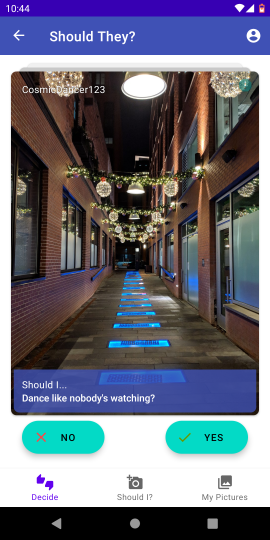

# Should I?

A photo-sharing app where you can take a picture, add a caption, and have others help you decide if you should do something.

### Frameworks and Libraries

- **LiveData** for updating the UI with changes
- **Navigation** to implement Single Activity architecture
- **Room** for local DB
- **ViewModel** for MVVC architecture
- **CameraX** to handle taking pictures
- **Glide** for image loading
- **Material** for UI components wherever possible

### Back-end

The app uses the following Firebase components:

- **Firestore** for captions and metadata
- **Storage** to save the pictures
- **AuthUI** for authentication

## License

**Should I** is licensed under Apache License 2.0.

See [LICENSE](LICENSE)
